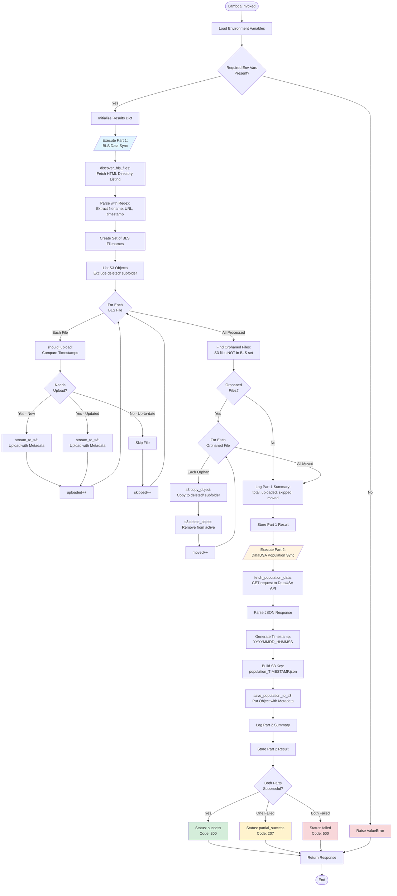
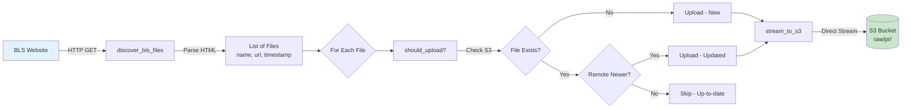
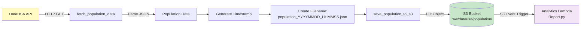
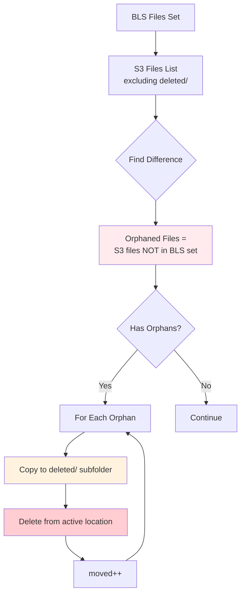
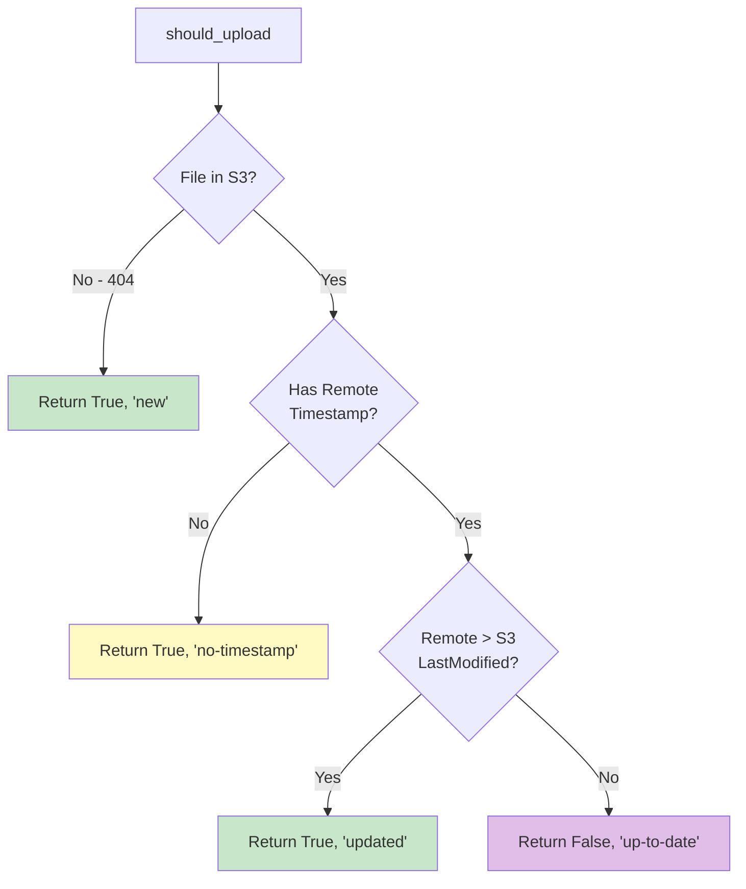
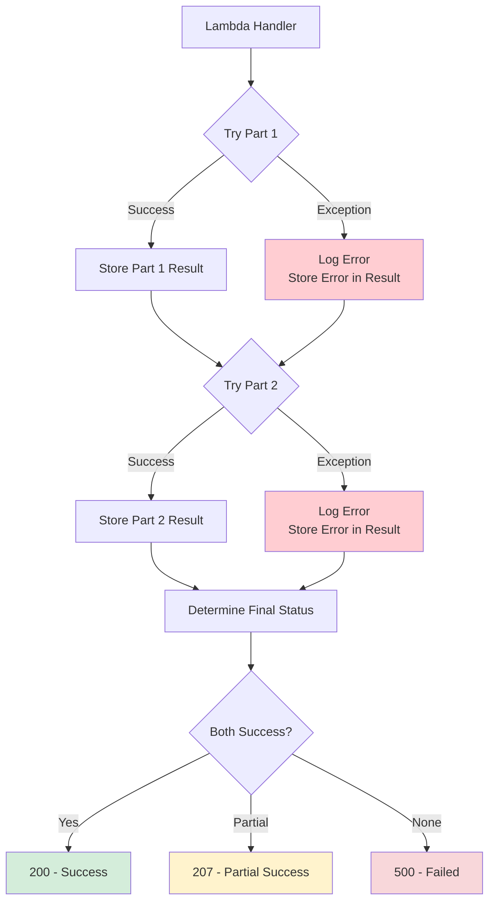
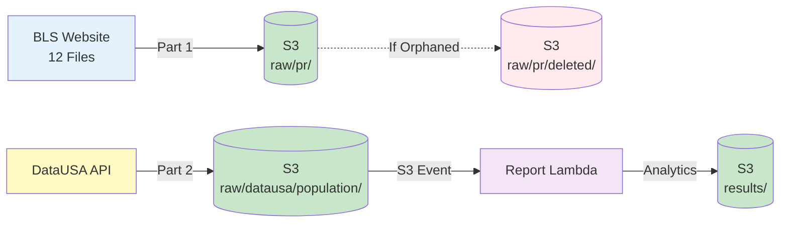
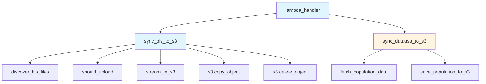

# pullDataFromApi.py Flow Diagram

> **Note:** To view the Mermaid diagrams in VS Code, install the [Mermaid Preview](https://marketplace.visualstudio.com/items?itemName=bierner.markdown-mermaid) extension or view on GitHub.

## Overview
Combined Lambda handler that executes Part 1 (BLS Data Sync) and Part 2 (DataUSA Population Sync) sequentially.

## Main Flow Diagram

## Part 1: BLS Data Sync - Detailed Flow

## Part 2: DataUSA Population Sync - Detailed Flow

## Deletion Tracking Logic

## Timestamp Comparison (should_upload)

## Error Handling Flow

## Data Flow Summary

## Function Call Hierarchy

## Key Environment Variables

| Variable | Purpose | Default |
|----------|---------|---------|
| `BLS_SYNC_BUCKET` | S3 bucket name | *Required* |
| `BLS_SYNC_USER_AGENT` | HTTP User-Agent header | *Required* |
| `BLS_SYNC_PREFIX` | S3 prefix for BLS data | `raw/pr/` |
| `BLS_SYNC_URL` | BLS directory URL | `https://download.bls.gov/pub/time.series/pr/` |
| `DATAUSA_SYNC_PREFIX` | S3 prefix for population data | `raw/datausa/population/` |
| `DATAUSA_API_URL` | DataUSA API endpoint | `https://honolulu-api.datausa.io/...` |

## Execution Summary

### Part 1 Output
- `total`: Number of BLS files discovered
- `uploaded`: Files uploaded (new or updated)
- `skipped`: Files already up-to-date
- `moved`: Orphaned files moved to deleted/
- `errors`: Number of errors encountered

### Part 2 Output
- `success`: Boolean indicating success
- `s3_key`: S3 key where data was saved
- `record_count`: Number of population records
- `api_url`: Source API URL

### Final Response
- `statusCode`: 200 (success), 207 (partial), 500 (failed)
- `body`: JSON with both part results and overall status
